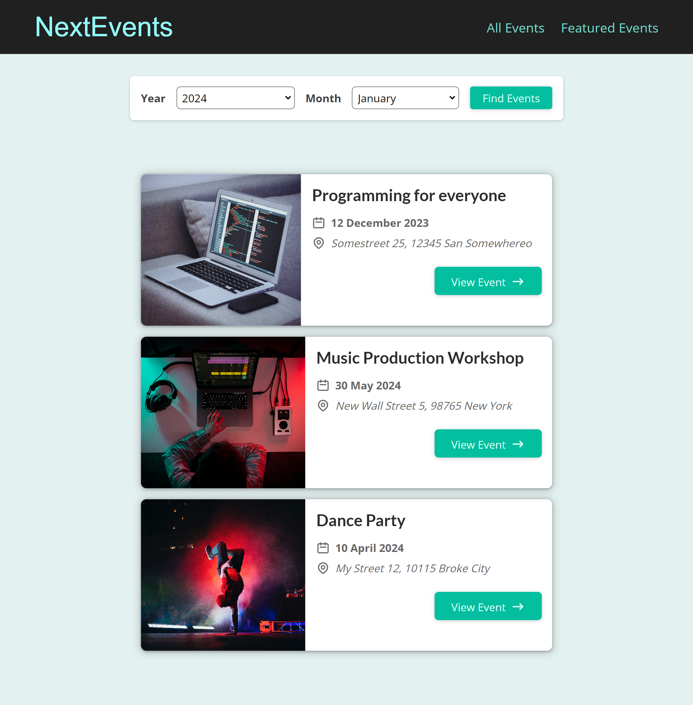

# Events website using Next.js 

NextEvents is a website to showcase various events around the world.

The goal of this project was to learn the basics of Next.js and file-based routing.

## Screenshot


Some features:
1. Multiple Pages to view All events, Selected Event, Featured events, Filtered events etc.
2. Filter Events by Year and Month.
3. Alert Dialog for errors.

More events can be added by updating the DUMMY_EVENTS object in dummy-data.js

## Getting Started

First, run the development server:

```bash
npm run dev
# or
yarn dev
```

Open [http://localhost:3000](http://localhost:3000) with your browser to see the result.

You can start editing the page by modifying `pages/index.js`. The page auto-updates as you edit the file.

## Learn More

To learn more about Next.js, take a look at the following resources:

- [Next.js Documentation](https://nextjs.org/docs) - learn about Next.js features and API.
- [Learn Next.js](https://nextjs.org/learn) - an interactive Next.js tutorial.

You can check out [the Next.js GitHub repository](https://github.com/vercel/next.js/) - your feedback and contributions are welcome!
